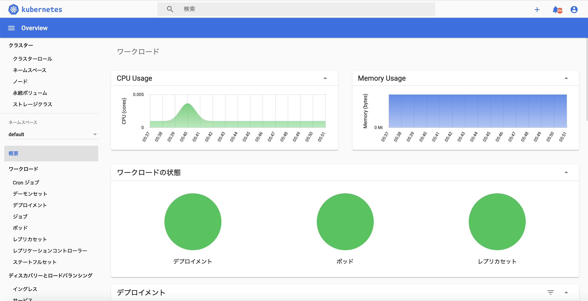

# metrics serverのインストール
kubernetesのダッシュボードの元となる分析数値はこのmetricsサーバーによって解析された値を元とします。

だから、metrics serverをインストールする必要があります。

また、水平スケールアウトのトリガー値もこのmetrics serverの分析値を元に行います。

https://github.com/kubernetes-sigs/metrics-server

```
kubectl apply -f https://github.com/kubernetes-sigs/metrics-server/releases/download/v0.3.7/components.yaml
```

以下のコマンドでmetrics serverがインストールされているか確認
```
$ kubectl get deploy -n kube-system
NAME                                        READY   UP-TO-DATE   AVAILABLE   AGE
cluster-autoscaler-aws-cluster-autoscaler   1/1     1            1           13d
coredns                                     2/2     2            2           15d
metrics-server                              1/1     1            1           14d
```
metrics serverはgithubに上がっているyamlを見ると確認できますが、kube-systemのnamespaceにインストールされます。

# dashboardのインストール
https://github.com/kubernetes/dashboard

```
kubectl apply -f https://raw.githubusercontent.com/kubernetes/dashboard/v2.0.4/aio/deploy/recommended.yaml

```

```
kubectl proxy
```
このコマンドはlocalからマスターノードのapiサーバーにセキュアなトンネルを確立します。

Now access Dashboard at:

http://localhost:8001/api/v1/namespaces/kubernetes-dashboard/services/https:kubernetes-dashboard:/proxy/.

secretを取得
```
kubectl get secret kubernetes-dashboard-token-25kqj -n kubernetes-dashboard -o yaml
```

tokenをデコードして取り出す
```
echo {token} | base64 -D
```
ところが、このTokenでログインしてもmetricsを見ることができません。

これは、このtokenにpermissionがないからです。

なので、cluster-adminの権限を持つservice accountを作成する必要があります。

```
kubectl apply -f eks-admin-service-account.yaml
```

そしてここで作成したsaがsecretを持っています。それを使ってdashboardにログインします。

```
kubectl get sa eks-admin  -n kube-system -o yaml
```
出力がこちら
```
apiVersion: v1
kind: ServiceAccount
metadata:
  annotations:
    kubectl.kubernetes.io/last-applied-configuration: |
      {"apiVersion":"v1","kind":"ServiceAccount","metadata":{"annotations":{},"name":"eks-admin","namespace":"kube-system"}}
  creationTimestamp: "2020-10-10T20:19:19Z"
  name: eks-admin
  namespace: kube-system
  resourceVersion: "174509"
  selfLink: /api/v1/namespaces/kube-system/serviceaccounts/eks-admin
  uid: 3270f5b9-9b04-4afb-b512-d77352f757f9
secrets:
- name: eks-admin-token-vrjzd // これが欲しい
```

```
kubectl get secret eks-admin-token-vrjzd  -n kube-system -o yaml
```

tokenをデコードして取り出す
```
echo {token} | base64 -D
```



dashboardを開くことができました。