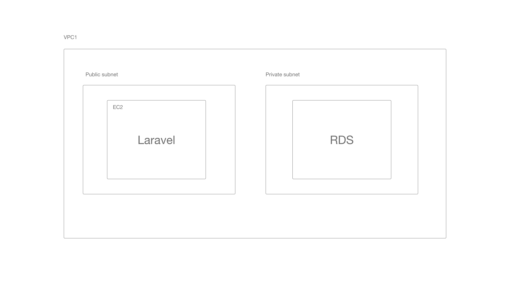
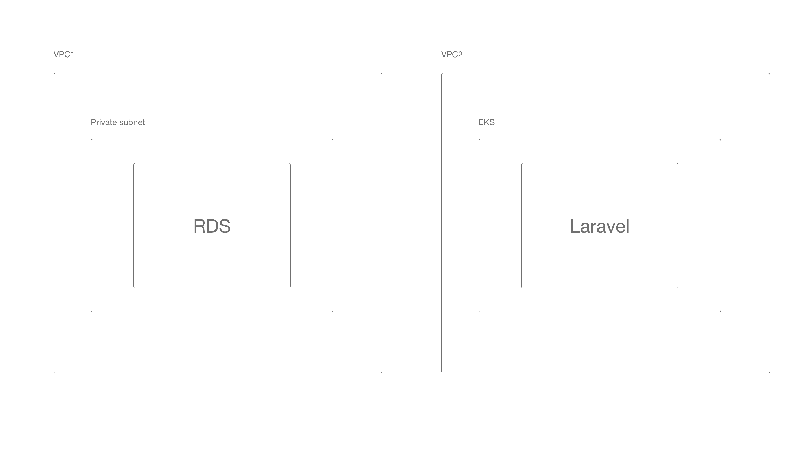
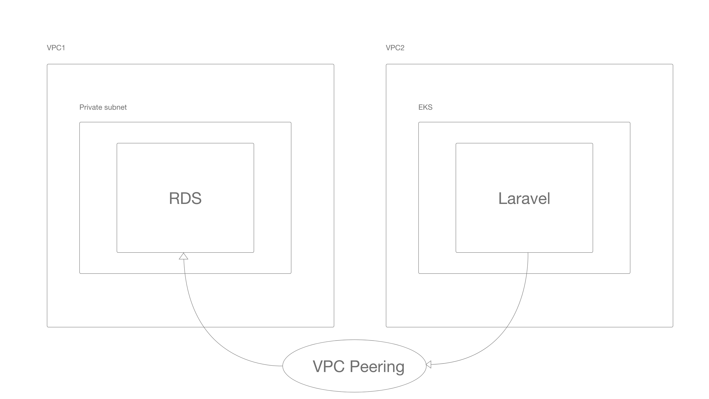
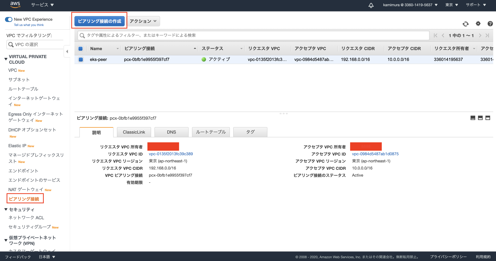
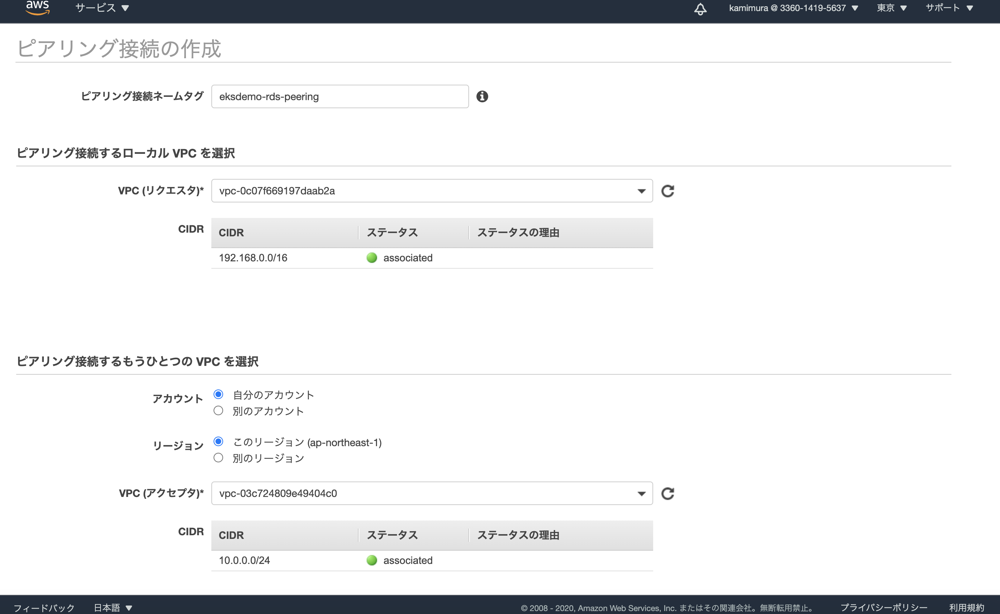
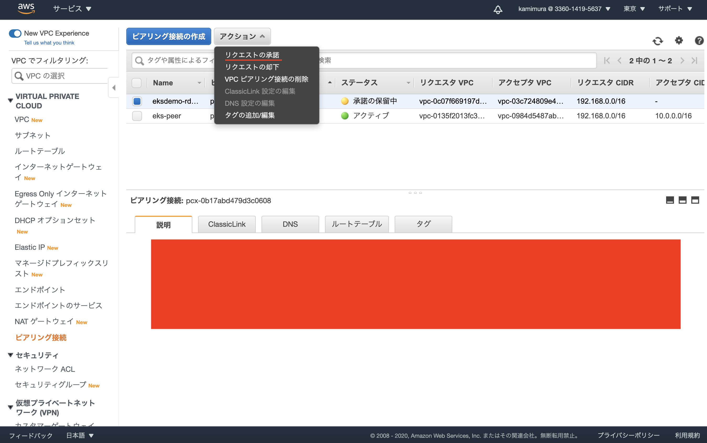

# 手順
今回は、既存で走っているサービスをk8sへ移行することを想定し、k8sクラスターとは別のvpcで走っているRDSとk8sClusterをVPCピアリング接続で接続してClusterからRDSへアクセスできるようにします。

# アーキテクチャー図解

まずはk8s以前のアーキテクチャー図解



上図の様に、同一VPC内でpublic subnetとprivate subnetで分割し、それぞれにlaravelの動いているEC2インスタンス、RDSを配置しています。

同一VPC内なのでlaravelからRDSに対してルーティングが届きます。



ところが、上図のようにEKSでクラスターを作成すると、既存のRDSとVPCが異なってしまうため、そのままではRDSへ通信が届きません。

そこでVPC Peeringで下図のようにVPC間のネットワークを繋ぎます。


# 実装

1. RDS用のVPCを作成
```
aws ec2 create-vpc --region ap-northeast-1 --cidr-block 10.0.0.0/24 | jq '{VpcId:.Vpc.VpcId,CidrBlock:.Vpc.CidrBlock}'
{
  "VpcId": "vpc-03c724809e49404c0",
  "CidrBlock": "10.0.0.0/24"
}

# Export the RDS VPC ID for easy reference in the subsequent commands
$ export RDS_VPC_ID=vpc-03c724809e49404c0
```

2. サブネットを作成
RDSにはサブネットが二個必要

```
aws ec2 create-subnet --region ap-northeast-1 --availability-zone "ap-northeast-1a" --vpc-id ${RDS_VPC_ID} --cidr-block 10.0.0.0/25 | jq '{SubnetId:.Subnet.SubnetId,AvailabilityZone:.Subnet.AvailabilityZone,CidrBlock:.Subnet.CidrBlock,VpcId:.Subnet.VpcId}'
{
  "SubnetId": "subnet-0081962fc76c39fcb",
  "AvailabilityZone": "ap-northeast-1a",
  "CidrBlock": "10.0.0.0/25",
  "VpcId": "vpc-03c724809e49404c0"
}
```

```
aws ec2 create-subnet --region ap-northeast-1 --availability-zone "ap-northeast-1c" --vpc-id ${RDS_VPC_ID} --cidr-block 10.0.0.128/25 | jq '{SubnetId:.Subnet.SubnetId,AvailabilityZone:.Subnet.AvailabilityZone,CidrBlock:.Subnet.CidrBlock,VpcId:.Subnet.VpcId}'
{
  "SubnetId": "subnet-073e3e81906c62a5d",
  "AvailabilityZone": "ap-northeast-1c",
  "CidrBlock": "10.0.0.128/25",
  "VpcId": "vpc-03c724809e49404c0"
}
```

各VPCには、ネットワークトラフィックの送信先を制御する暗黙のルーターがあります。VPCの各サブネットは、サブネットのルーティングを制御するルートテーブルに明示的に関連付ける必要があります。

先に進んで、作成したこれら2つのサブネットをVPCのルートテーブルに関連付けましょう。

```
aws ec2 describe-route-tables --region ap-northeast-1 --filters Name=vpc-id,Values=${RDS_VPC_ID} | jq '.RouteTables[0].RouteTableId'
"rtb-0e8cddc7ad122de83"

export RDS_ROUTE_TABLE_ID=rtb-0e8cddc7ad122de83

aws ec2 associate-route-table --region ap-northeast-1 --route-table-id ${RDS_ROUTE_TABLE_ID} --subnet-id subnet-0081962fc76c39fcb

{
    "AssociationId": "rtbassoc-0400576e725783528",
    "AssociationState": {
        "State": "associated"
    }
}

aws ec2 associate-route-table --region ap-northeast-1 --route-table-id ${RDS_ROUTE_TABLE_ID} --subnet-id subnet-073e3e81906c62a5d

{
    "AssociationId": "rtbassoc-0a07d50a8269cac1c",
    "AssociationState": {
        "State": "associated"
    }
}
```

# RDSのサブネットグループを作成する
```
aws rds create-db-subnet-group \
--region ap-northeast-1 \
--db-subnet-group-name "DemoDBSubnetGroup" \
--db-subnet-group-description "Demo DB Subnet Group" \
--subnet-ids "subnet-0081962fc76c39fcb" "subnet-073e3e81906c62a5d" | jq '{DBSubnetGroupName:.DBSubnetGroup.DBSubnetGroupName,VpcId:.DBSubnetGroup.VpcId,Subnets:.DBSubnetGroup.Subnets[].SubnetIdentifier}'

# response:
{
  "DBSubnetGroupName": "demodbsubnetgroup",
  "VpcId": "vpc-03c724809e49404c0",
  "Subnets": "subnet-073e3e81906c62a5d"
}
{
  "DBSubnetGroupName": "demodbsubnetgroup",
  "VpcId": "vpc-03c724809e49404c0",
  "Subnets": "subnet-0081962fc76c39fcb"
}
```

# VPCセキュリティーグループを作成
```
aws ec2 create-security-group \
--region ap-northeast-1 \
--group-name DemoRDSSecurityGroup \
--description "Demo RDS security group" \
--vpc-id ${RDS_VPC_ID}

{
    "GroupId": "sg-0657421c415738cb4"
}
# Export the RDS VPC Security Group ID for easy reference in the subsequent commands
$ export RDS_VPC_SECURITY_GROUP_ID=sg-0657421c415738cb4
```

# RDSを作成する

```
aws rds create-db-instance \
  --region ap-northeast-1 \
  --db-name eksdemo \
  --db-instance-identifier eksdemo \
  --allocated-storage 10 \
  --db-instance-class db.t2.micro \
  --engine mysql \
  --engine-version "5.7.26" \
  --master-username eksdemo \
  --master-user-password password \
  --no-publicly-accessible \
  --vpc-security-group-ids ${RDS_VPC_SECURITY_GROUP_ID} \
  --db-subnet-group-name "demodbsubnetgroup" \
  --availability-zone ap-northeast-1a \
  --port 3306 | jq '{DBInstanceIdentifier:.DBInstance.DBInstanceIdentifier,Engine:.DBInstance.Engine,DBName:.DBInstance.DBName,VpcSecurityGroups:.DBInstance.VpcSecurityGroups,EngineVersion:.DBInstance.EngineVersion,PubliclyAccessible:.DBInstance.PubliclyAccessible}'

  # response:
  {
  "DBInstanceIdentifier": "eksdemo",
  "Engine": "mysql",
  "DBName": "eksdemo",
  "VpcSecurityGroups": [
    {
      "VpcSecurityGroupId": "sg-0657421c415738cb4",
      "Status": "active"
    }
  ],
  "EngineVersion": "5.7.26",
  "PubliclyAccessible": false
}
```

# 異なるVPC間に橋をかける

1. Peeringの作成
VPC画面の以下のページから作成できます。

「ピアリング接続の作成」ぼたんをクリックしましょう。


すると以下の画面が開きます。



リクエスタにEKSのVPCを、アクセプタにRDSのVPCをセットします。


リクエストの承諾をクリックしPeeringを有効にします。


```
$ export VPC_PEERING_CONNECTION_ID=pcx-0b17abd479d3c0608
```

2. EKSクラスターのルートテーブルの更新

```
aws ec2 describe-route-tables --region ap-northeast-1 --filters Name="tag:Name",Values="eksctl-eksdemo-cluster/PublicRouteTable" | jq '.RouteTables[0].RouteTableId'

"rtb-02a806ad287ccae09"

export EKS_ROUTE_TABLE_ID=rtb-02a806ad287ccae09

aws ec2 create-route --region ap-northeast-1 --route-table-id ${EKS_ROUTE_TABLE_ID} --destination-cidr-block 10.0.0.0/24 --vpc-peering-connection-id ${VPC_PEERING_CONNECTION_ID}

# response:
{
    "Return": true
}
```

3. RDSクラスターのルートテーブルの更新
RDSのルートテーブルをコンソールから調べて以下のコマンドを実行

```
export RDS_ROUTE_TABLE_ID=rtb-0e8cddc7ad122de83

aws ec2 create-route --region ap-northeast-1 --route-table-id ${RDS_ROUTE_TABLE_ID} --destination-cidr-block 192.168.0.0/16 --vpc-peering-connection-id ${VPC_PEERING_CONNECTION_ID}
```

4. 4RDSインスタンスのセキュリティグループを更新する

EKSクラスターから3306ポート上のRDSインスタンスへのすべての入力トラフィックを許可します。

```
$ aws ec2 authorize-security-group-ingress --region ap-northeast-1 --group-id ${RDS_VPC_SECURITY_GROUP_ID} --protocol tcp --port 3306 --cidr 192.168.0.0/16

```

# テスト用のMYSQLDeploymentを作成してMYSQLへ接続チェック

```
$ kubectl apply -f debug_mysql.yaml
```

```
$ kubectl get all

NAME                                READY   STATUS    RESTARTS   AGE
pod/mysql-client-6d5858c459-8qzj7   1/1     Running   0          5m56s

NAME                 TYPE        CLUSTER-IP   EXTERNAL-IP   PORT(S)   AGE
service/kubernetes   ClusterIP   10.100.0.1   <none>        443/TCP   6h34m

NAME                           READY   UP-TO-DATE   AVAILABLE   AGE
deployment.apps/mysql-client   1/1     1            1           5m57s

NAME                                      DESIRED   CURRENT   READY   AGE
replicaset.apps/mysql-client-6d5858c459   1         1         1       5m57s
```

Pod内部へ入る
```
$ kubectl exec -it mysql-client-6d5858c459-8qzj7 sh
```

```
# mysql -h eksdemo.cqyv2st56hxy.ap-northeast-1.rds.amazonaws.com -u eksdemo -p
Enter password:
Welcome to the MySQL monitor.  Commands end with ; or \g.
Your MySQL connection id is 210
Server version: 5.7.26-log Source distribution

Copyright (c) 2000, 2020, Oracle and/or its affiliates. All rights reserved.

Oracle is a registered trademark of Oracle Corporation and/or its
affiliates. Other names may be trademarks of their respective
owners.

Type 'help;' or '\h' for help. Type '\c' to clear the current input statement.

mysql> show databases;
+--------------------+
| Database           |
+--------------------+
| information_schema |
| eksdemo            |
| innodb             |
| mysql              |
| performance_schema |
| sys                |
+--------------------+
6 rows in set (0.00 sec)

mysql>
```

databaseに接続できました。